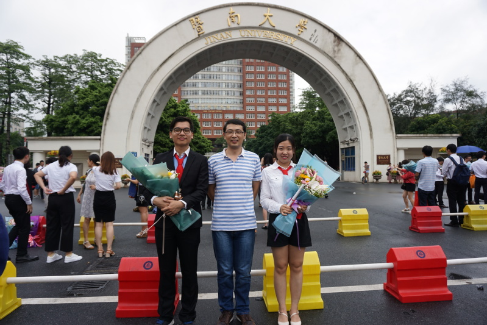

AntLab成立至今终于有了第一批毕业生，实验室2016级专硕研究生张羽翔和张凤洁顺利毕业。

张羽翔同学在两年读研期间，在崔林导师的指导下以第一作者发表了一篇期刊论文和四篇会议论文，并获得了优秀毕业生荣誉称号以及国家奖学金，现就职于华为2012实验室；张凤洁同学也在读研期间表现优异，顺利毕业，现就职于工商银行珠海软件开发中心。

恭喜两位同学顺利毕业并获得了优秀企业的offer，相信两位同学在离开学校之后进入企业都能有很好的职业发展！

